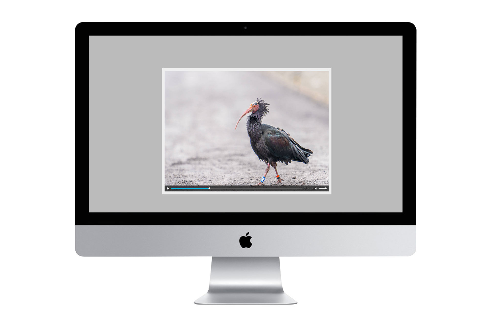

# Multimediales


#### Inhalt in diesem Abschnitt
[[toc]]

## Bild mit Audio


Oftmals wirkt ein Bild noch stärker, wenn es mit einem Audio zusammengebracht wird. 
Dadurch werden ähnlich wie bei Videos noch mehr Sinne angesprochen, was zu einem positiven Erlebnis führen kann.

#### Komponent einsetzen
Um diesen Komponenten einzusetzen, gibt es einen einfachen Trick.
Dafür nutzt man den `HTML5` `<video>`-Tag.
Nun setzt man als Standbild `poster` ein Foto und als `src` die Audio-Dateien.

Im Einsatz sieht das ganze so aus:
```html{3-9}
<section class="story-section">
  <div class="story-media-image">
    <video class="story-media-image-player" width="1920" height="1280" controls poster="../src/assets/images/poster-audio.jpg">
      <source src="../src/assets/audio/audio.ogg" type="audio/ogg">
      <source src="../src/assets/audio/audio.mp3" type="audio/mpeg">
      Leider unterstützt dein Browser keine Audio-Tags. Wenn du möchtest, kannst du das Audio
      <a href="../src/assets/audio/audio.mp3">herunterladen</a> und in deinem eigenen Audio-Player
      anhören.
    </video>
  </div>
</section>
```

#### Verfügbare CSS-Klassen für Styling
| CSS-Klasse | Beschreibung |
| ------------- | ------------- |
| `.story-media-image` | Klasse für das Styling des Wrappers. |
| `.story-media-image-player` | Klasse für das `<video>` Element. |

## Multimediale Slideshow
<video width="1920" height="1080" autoplay  muted loop playsinline >
  <source src="../../assets/videos/Media-Slideshow.mp4" type="video/mp4">
  Your browser does not support the video tag.
</video> 

Audio in Kombination mit einem Bild und einer Interaktionsmöglichkeit. Beim Einsatz von einer multimedialen Slideshow werden 
viele Sinne angesprochen und mit kleinen Erfolgserlebnissen durch die Interaktionsmöglichkeit bereichert.
Dieses Element kann beim richtigen Einsatz sehr positiv auf die Geschichte wirken.

#### Komponent einsetzen
Durch den nachfolgenden Aufbau kannst du einfach multimediale Slideshow mittels einer **Storytellr-Funktion** einfach generieren lassen.

```html
<section class="story-section">
  <div class="story-media-slideshow" id="mediaSlideshow">
    <div class="story-media-slideshow-container">
      <div class="story-media">
      <video class="story-media-player" width="1920" height="1280" controls poster="../src/assets/images/poster-audio01.jpg">
        <source src="../src/assets/audio/audio01.ogg" type="audio/ogg">
        <source src="../src/assets/audio/audio01.mp3" type="audio/mpeg">
        Leider unterstützt dein Browser keine Audio-Tags. Wenn du möchtest, kannst du das Audio
        <a href="../src/assets/audio/audio01.mp3">herunterladen</a> und in deinem eigenen Audio-Player
        anhören.
      </video>
      </div>
    </div>

    <div class="story-media-slideshow-container">
      <div class="story-media">
      <video class="story-media-player" width="1920" height="1280" controls poster="../src/assets/images/poster-audio02.jpg">
        <source src="../src/assets/audio/audio02.ogg" type="audio/ogg">
        <source src="../src/assets/audio/audio02.mp3" type="audio/mpeg">
        Leider unterstützt dein Browser keine Audio-Tags. Wenn du möchtest, kannst du das Audio
        <a href="../src/assets/audio/audio02.mp3">herunterladen</a> und in deinem eigenen Audio-Player
        anhören.
      </video>
      </div>
    </div>

    <div class="story-media-slideshow-container">
      <div class="story-media">
      <video class="story-media-player" width="1920" height="1280" controls poster="../src/assets/images/poster-audio03.jpg">
        <source src="../src/assets/audio/audio03.ogg" type="audio/ogg">
        <source src="../src/assets/audio/audio03.mp3" type="audio/mpeg">
        Leider unterstützt dein Browser keine Audio-Tags. Wenn du möchtest, kannst du das Audio
        <a href="../src/assets/audio/audio03.mp3">herunterladen</a> und in deinem eigenen Audio-Player
        anhören.
      </video>
      </div>
    </div>
  </div>
</section>
```

Damit die Slideshow nun generiert wird, musst du die Funktion `$story.MediaSlideshow` aufrufen.

```js
new $story.MediaSlideshow({
  id: "mediaSlideshow", // deine definierte ID
  autoplay: true // default: true
})
```

| Parameter        | Type     | Wert  | Beschreibung
| ------------- | ------------- | ------------- |------------- |
| `id`<span class="required-star">*</span> | `String` | mediaSlideshow| Deine zuvor definierte ID im HTML. |
| `autoplay` | `Boolean` | `true` / `false`| Sollen die Audios beim durchklicken der Slideshow automatisch gestartet und gestoppt werden? |


#### Generierter HTML-Code
```html
<section class="story-section">
  <div class="story-media-slideshow" id="mediaSlideshow">
    <div class="story-media-slideshow-container" style="display: block;">
      <div class="story-media">
      <video class="story-media-player" controls="" poster="../src/assets/images/poster-audio01.jpg" width="1920" height="1280">
        <source src="../src/assets/audio/audio01.ogg" type="audio/ogg">
        <source src="../src/assets/audio/audio01.mp3" type="audio/mpeg">
        Leider unterstützt dein Browser keine Audio-Tags. Wenn du möchtest, kannst du das Audio
        <a href="../src/assets/audio/audio01.mp3">herunterladen</a> und in deinem eigenen Audio-Player
        anhören.
      </video>
      </div>
      <div class="story-media-controllers">
        <span class="story-media-controller story-media-controller-0 active-media-controller" onclick="$story.MediaSlideshow.showCurrentMedia(&quot;mediaSlideshow&quot;, true, 0)"></span>
        <span class="story-media-controller story-media-controller-1" onclick="$story.MediaSlideshow.showCurrentMedia(&quot;mediaSlideshow&quot;, true, 1)"></span>
        <span class="story-media-controller story-media-controller-2" onclick="$story.MediaSlideshow.showCurrentMedia(&quot;audioSlideshow&quot;, true, 2)"></span>
      </div>
    </div>

    <div class="story-media-slideshow-container" style="display: none;">
      <div class="story-media">
      <video class="story-media-player" controls="" poster="../src/assets/images/poster-audio02.jpg" width="1920" height="1280">
        <source src="../src/assets/audio/audio02.ogg" type="audio/ogg">
        <source src="../src/assets/audio/audio02.mp3" type="audio/mpeg">
        Leider unterstützt dein Browser keine Audio-Tags. Wenn du möchtest, kannst du das Audio
        <a href="../src/assets/audio/audio02.mp3">herunterladen</a> und in deinem eigenen Audio-Player
        anhören.
      </video>
      </div>
      <div class="story-media-controllers">
        <span class="story-media-controller story-media-controller-0 active-media-controller" onclick="$story.MediaSlideshow.showCurrentMedia(&quot;mediaSlideshow&quot;, true, 0)"></span>
        <span class="story-media-controller story-media-controller-1" onclick="$story.MediaSlideshow.showCurrentMedia(&quot;mediaSlideshow&quot;, true, 1)"></span>
        <span class="story-media-controller story-media-controller-2" onclick="$story.MediaSlideshow.showCurrentMedia(&quot;mediaSlideshow&quot;, true, 2)"></span>
      </div>
    </div>

    <div class="story-media-slideshow-container" style="display: none;">
      <div class="story-media">
      <video class="story-media-player" controls="" poster="../src/assets/images/poster-audio03.jpg" width="1920" height="1280">
        <source src="../src/assets/audio/audio01.ogg" type="audio/ogg">
        <source src="../src/assets/audio/audio03.mp3" type="audio/mpeg">
        Leider unterstützt dein Browser keine Audio-Tags. Wenn du möchtest, kannst du das Audio
        <a href="../src/assets/audio/audio01.mp3">herunterladen</a> und in deinem eigenen Audio-Player
        anhören.
      </video>
      </div>
      <div class="story-media-controllers">
        <span class="story-media-controller story-media-controller-0 active-media-controller" onclick="$story.MediaSlideshow.showCurrentMedia(&quot;mediaSlideshow&quot;, true, 0)"></span>
        <span class="story-media-controller story-media-controller-1" onclick="$story.MediaSlideshow.showCurrentMedia(&quot;mediaSlideshow&quot;, true, 1)"></span>
        <span class="story-media-controller story-media-controller-2" onclick="$story.MediaSlideshow.showCurrentMedia(&quot;mediaSlideshow&quot;, true, 2)"></span>
      </div>
    </div>
  </div>
</section>
```
#### Verfügbare CSS-Klassen für Styling
Die folgenden **CSS-Klassen** können für ein individuelles Styling genutzt werden.

| CSS-Klasse | Beschreibung |
| ------------- | ------------- |
| `.story-media-slideshow` | Klasse für das Styling des Wrappers der Slideshow. |
| `.story-media-slideshow-container` | Klasse für das Styling des Containers der Slideshow. |
| `.story-media-controllers` | Klasse für das Styling des Wrappers der Controller. |
| `.story-media-controller` | Klasse für das Styling der einzelnen Controller. |
| `.active-media-controller` | Klasse für das Styling des aktiven Controllers. |
