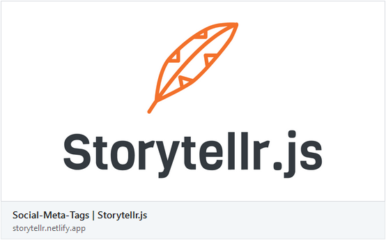
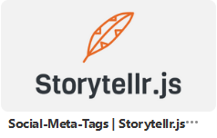

# Social-Meta-Tags


Der grosse Vorteil von Storytelling auf einer Webseite gegenüber anderen Storytelling-Formaten ist, dass zielgruppengerechte
Geschichten sehr gezielt über verschiedene Distributionskanäle an die jeweilige Zielgruppe gebracht werden können.

[[toc]]

#### Social-Meta-Tags einsetzen
Um Social-Meta-Tags zu verwenden, musst du verschiedene **Meta-Tags** in dem **Header-Bereich** deiner Webseite platzieren.

Neben den obligatorischen `title` und `description` Meta-Tags benötigst du die **Open-Graph** und die **Twitter** Tags.
```html
<!-- Meta Tags -->
<title>Social-Meta-Tags | Storytellr.js</title>
<meta name="title" content="Social-Meta-Tags | Storytellr.js">
<meta name="description" content="Mit dem Storytellr-Guide erfährst du wie du Social-Meta-Tags für Facebook, Twitter, LinkedIn und Pinterest verwendest.">

<!-- Open Graph für Facebook, LinkedIn und Pinterest -->
<meta property="og:type" content="website">
<meta property="og:url" content="https://storytellr.netlify.app/">
<meta property="og:title" content="Social-Meta-Tags | Storytellr.js">
<meta property="og:description" content="Mit dem Storytellr-Guide erfährst du wie du Social-Meta-Tags für Facebook, Twitter, LinkedIn und Pinterest verwendest.">
<meta property="og:image" content="https://storytellr.netlify.app/assets/logo/storytellr-social-logo.png">

<!-- Twitter -->
<meta property="twitter:card" content="summary_large_image">
<meta property="twitter:url" content="https://storytellr.netlify.app/">
<meta property="twitter:title" content="Social-Meta-Tags | Storytellr.js">
<meta property="twitter:description" content="Mit dem Storytellr-Guide erfährst du wie du Social-Meta-Tags für Facebook, Twitter, LinkedIn und Pinterest verwendest.">
<meta property="twitter:image" content="https://storytellr.netlify.app/assets/logo/storytellr-social-logo.png">
```

:::warning Social-Image
Achte beim Social-Image, dass du verwenden möchtest, auf eine gute Auflösung.
Im Idealfall nutzt du ein Bild mit einer Auflösung von **1200×628px**.

Bei bedarf kannst du auch ein grösseres Bild nutzen. Dabei ist es wichtig zu beachten, 
dass das Bild ein Seitenverhältnis von **1.91×1** hat.
:::

#### Resultat
Durch die eingefügten Social-Meta-Tags kann deine Webseite nun viel besser auf Social-Media geteilt werden.
Titel, URL, Type, Beschreibung und Anzeigebild werden automatisch für deinen Post generiert.

*Anzeige auf Facebook:*  


*Anzeige auf Twitter:*  


*Anzeige auf LinkedIn:*  


*Anzeige auf Pinterest:*  

